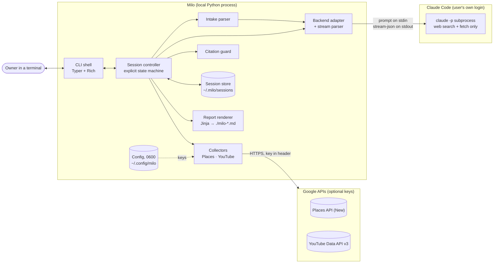
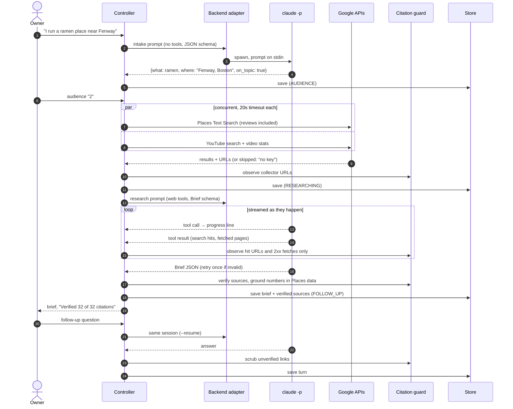
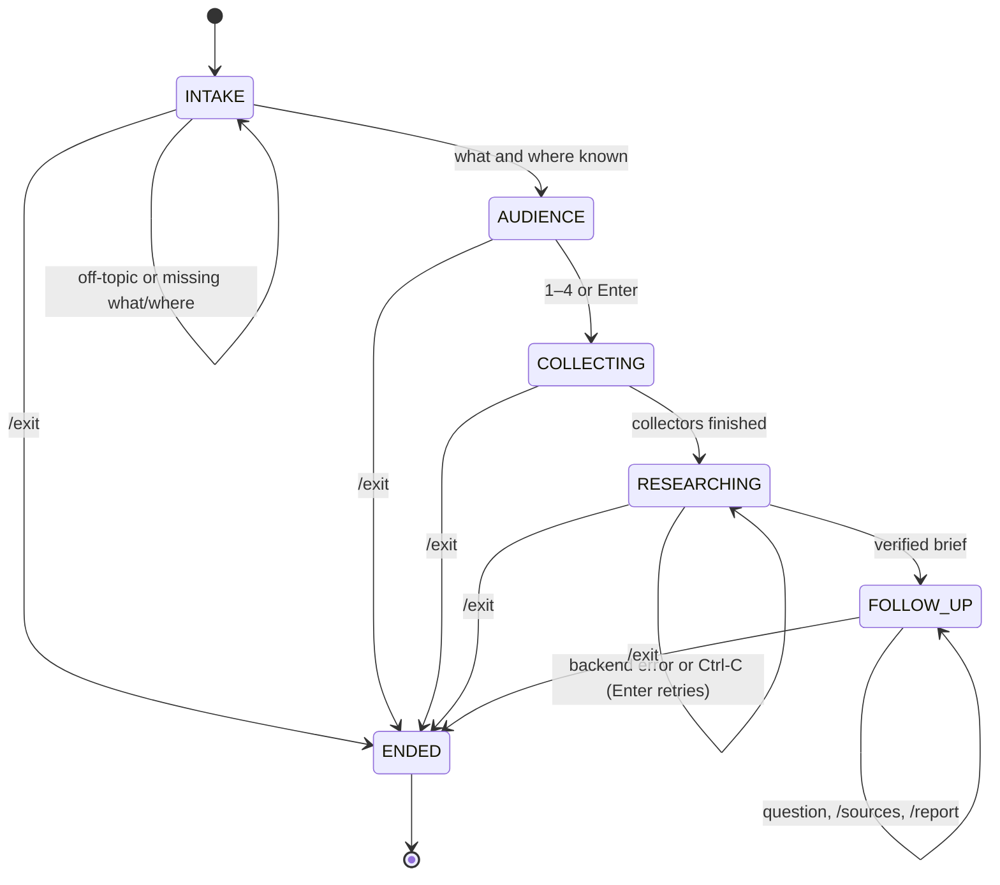

# Milo

**Marketing research for restaurants and food businesses, in your terminal.** Tell Milo what
you sell and where, and it comes back with competitors, review themes, gaps, five campaign
ideas, a 7-day content calendar, and sources you can check.

Milo uses your own [Claude Code](https://code.claude.com/docs/en/setup) login to do the
research. It never calls an LLM API itself and never asks for an LLM API key.

## Install

You need Python 3.11+ and Claude Code, installed and logged in:

```sh
curl -fsSL https://claude.ai/install.sh | bash   # skip if you already have Claude Code
claude auth login

pipx install git+https://github.com/nikhil-kunapareddy/milo
milo doctor
```

## Optional keys: `milo setup`

Milo works without any keys: it researches the web through Claude Code. Two optional keys add
structured local data:

| Key | Adds | Where to get it |
|---|---|---|
| Google Places | Competitors with ratings, review counts, prices, and review text | [Get an API key](https://developers.google.com/maps/documentation/places/web-service/get-api-key), then enable **Places API (New)** for its project |
| YouTube Data API | Local food videos with view counts | [Get started](https://developers.google.com/youtube/v3/getting-started), then enable **YouTube Data API v3** |

```sh
milo setup    # paste each key or press Enter to skip; each one is checked before it's saved
milo doctor   # backend and key status, with keys masked (AIza…x9Q)
```

Keys are stored in `~/.config/milo/config.toml`, readable only by you (`0600`). The
environment variables `MILO_PLACES_KEY` and `MILO_YOUTUBE_KEY` override the file.

## Usage

A real session, run without any optional keys:

```
$ milo
Milo · marketing research for food businesses
Backend: Claude Code ✓ · Google Places – (not configured) · YouTube – (not configured)

What do you want to market, and where?  (e.g. "ramen in Boston")
> I run a ramen place near Fenway, want more students

Who is this for?  [1] New opening  [2] Existing restaurant  [3] Creator  [4] Chain adding a location  (Enter to skip)
> 2
– Google Places skipped (no key)
– YouTube skipped (no key)
→ Researching local marketing and best practices…
✓ Searched 30 times and read 31 pages (7m 53s)
✓ Verified 32 of 32 citations

[brief: market snapshot, competitors, review themes, content benchmarks, gaps,
 5 campaign ideas, 7-day content calendar, numbered sources]

Ask a follow-up, or /report, /sources, /exit
> which competitor has the weakest social presence?
✓ Verified 12 of 12 links
[answer: Santouka Back Bay's Instagram looks abandoned (latest visible posts from 2018)…]

> how do I fix a python import error?
That's outside what Milo covers. Ask about marketing ramen in Fenway, Boston: competitors, offers, content, or customers.

> /report
Saved ./milo-ramen-fenway-boston-2026-09-28.md
```

With a Google Places key, the collection step adds lines like `✓ Found 20 competitors (Google
Places)` and the competitor table gets ratings, review counts, and prices.

Research is thorough by design: a brief takes about 5 to 10 minutes. Follow-ups continue the
same research session and can search the web again.

| Command | What it does |
|---|---|
| `milo` | Start a new session |
| `milo resume [session-id]` | Reopen a saved session (the most recent if no id) and keep asking follow-ups |
| `milo setup` | Add or change the optional keys |
| `milo doctor` | Check Claude Code and your keys |
| `milo --backend codex` | Pick a backend (Codex isn't supported yet) |
| `/report` | Write the Markdown report to the current folder (never overwrites: `-2`, `-3`, …) |
| `/sources` | List every verified source so far |
| `/exit` | Save the session and quit (Ctrl-D works too) |
| `/help` | List commands |

Ctrl-C during research stops it and keeps the session. Press Enter to try again, or run
`milo resume` later. Sessions live in `~/.milo/sessions/<id>/session.json`.

## System design

Milo is a small, local agent harness: about 2,800 lines of Python around one external
reasoning engine (the user's Claude Code CLI), with 231 tests. The model does the research
and writing. Everything that has to be dependable (flow, validation, citations, storage,
the report) is ordinary deterministic code.

### Design principles

1. **Deterministic code owns the flow; the model owns the reasoning.** Session states, input
   checks, and the report layout are Python, not prompts.
2. **API keys never enter the model's context.** Collectors call Google in Python and hand
   over only results. Keys go in request headers, never URLs, and are stripped from the
   environment of the `claude` process.
3. **Every citation is verified.** A URL can appear in a brief, answer, or report only if it
   came back in this session: a web search result, a page that fetched successfully, or a
   collector result. Anything else is removed ("Verified 11 of 12 citations, 1 removed").

### Architecture



| Component | Responsibility | Deliberately does not |
|---|---|---|
| CLI shell (`cli.py`) | Reads input, renders events with Rich, `setup` / `doctor` / `resume` | Hold any business logic |
| Session controller (`session.py`) | Owns the state machine; turns input into typed UI events | Print anything |
| Intake parser (`intake.py`) | Free text → `{what, where, on_topic}` via one tool-less, schema-checked call | Guess when parsing fails (it falls back to asking) |
| Collectors (`collectors/`) | Concurrent Google API calls with timeouts; results plus the URLs they surfaced | Raise: every failure becomes `skipped` or `error` with a short note |
| Backend adapter (`backends/`) | The only code that knows Claude Code's flags and event shapes | Leak Claude-specific details into the rest of the app |
| Citation guard (`guard.py`) | Tracks observed URLs; drops, renumbers, and scrubs everything else | Trust any URL the model writes |
| Session store (`store.py`) | One JSON file per session, written atomically on every state change | Store keys |
| Report renderer (`report.py`) | Markdown built from the stored session | Ask the model to write the report |

### Request lifecycle



### Session state machine



Each state declares which input kinds it accepts (text, empty, command) in an explicit table.
Anything else gets a one-line hint and leaves the state unchanged. Transitions outside the
table raise, and the tests check both tables. `ENDED` is never written to disk: a saved
session keeps its last active state, so `milo resume` lands exactly where the user left off.

### Key decisions and trade-offs

| Decision | Why | Trade-off |
|---|---|---|
| Shell out to the user's `claude` CLI instead of calling an LLM API | No API key to manage; users bring their existing login and plan | Depends on the CLI's flags and output format, so all of that is isolated in `backends/` and pinned by recorded transcripts |
| Parse `--output-format stream-json` line by line | Progress shows while research runs; the session id arrives first, so a crash is still resumable | Must survive unknown events and huge lines (32 MB read limit, junk lines ignored) |
| `--json-schema` generated from the pydantic `Brief`, then pydantic validation | The CLI enforces the shape, including "exactly 5 ideas" and "exactly 7 days"; Python checks it again | One extra agent turn; one repair retry in the same session, then a raw-text fallback |
| Observed URLs come only from structured fields | A search's prose summary is written by a smaller model and can invent links | Stricter than "any URL in a tool result": a real URL mentioned only in prose is dropped |
| Ratings, review counts, and prices come only from Places data | Removes a whole class of hallucinated numbers | Without a Places key those columns are empty rather than estimated |
| `--safe-mode`, `--tools WebSearch,WebFetch`, `--permission-prompts none`, empty working folder per session | The agent can't run code or touch files, and the user's own hooks, plugins, and MCP servers stay out | No local tools for the agent, which is the point |
| CLI runs in its own process group; stop sends SIGTERM, then SIGKILL | Ctrl-C never leaves orphaned `claude` processes holding pipes open | POSIX-first (Windows falls back to killing the one process) |
| One Places Text Search with `reviews` in the field mask | One billed request per session instead of search plus a Place Details call per competitor | Up to 5 reviews per place, which is Google's cap either way |
| JSON file per session, atomic write on every change | Crash-safe, inspectable, no database to install | Not built for thousands of sessions (not a goal for a local tool) |

### Security and privacy

- **Keys**: stored in `~/.config/milo/config.toml` (`0600`, folder `0700`), overridable by env
  vars, sent as `X-Goog-Api-Key` headers (never in URLs or logs), masked everywhere they're
  shown (`AIza…x9Q`), checked with free or 1-unit calls, and removed from the `claude`
  process's environment.
- **Agent sandbox**: only web search and web fetch exist in the agent's session; nothing
  else is allowed or prompted for. It runs from an empty folder, never with
  `--dangerously-skip-permissions`, and never with `--bare`, which would require an API key.
- **Data**: no telemetry. Sessions and reports stay on the user's machine.

### Failure handling

| Failure | What the user sees | State after |
|---|---|---|
| Missing, invalid, or over-quota key; network error | `– Google Places skipped (invalid key)`; the model is told not to invent that data | Continues |
| `claude` missing or logged out | The exact fix (install command, or `claude auth login`) | Unchanged |
| Research hits its turn limit | The same session is asked to wrap up with what it found | Continues |
| Brief isn't valid JSON | One repair retry; then the raw text, with unverified links removed | FOLLOW_UP |
| Backend error or crash mid-research | The error, then "Press Enter to try again" (collector data is kept) | RESEARCHING |
| Ctrl-C mid-run | "Stopped."; the backend and its children are terminated | Saved, resumable |

### Testing

231 tests, and none of them call a real API or the real `claude` CLI.

- **Stream parser**: runs over 8 recorded Claude Code transcripts: search + fetch, a
  failed 404 fetch, structured output, resume, not logged in, and max turns.
- **Subprocess plumbing**: driven by fake `claude` shell scripts (working folder, stdin
  prompt, stripped env, crash output, early kill, huge lines, streaming timing).
- **Collectors**: `respx` fixtures for success, missing key, invalid key (a recorded Google
  response), quota, API disabled, timeout, network error, and malformed bodies.
- **State machine, guard, research flow, report**: tested through the controller with a
  scripted fake backend.

### Project layout

```
milo/
  cli.py                 Typer app, REPL loop, Rich rendering
  session.py             state machine + controller + research/follow-up flow
  intake.py              free text -> what/where (schema-checked, lenient fallback)
  guard.py               observed-URL set, normalization, brief/text scrubbing
  models.py              pydantic models: Intake, CollectorResult, Brief, Session
  store.py · report.py · config.py
  collectors/            base.py (protocol, runner, Google errors), places.py, youtube.py
  backends/              base.py (protocol, events), claude_code.py, stream.py, codex.py
  prompts/               intake, research, follow-up, repair, wrap-up (Jinja)
  templates/report.md.j2
tests/                   one file per module, fixtures/ with recorded transcripts
```

## Data coverage and limitations

- Every report ends with a **Data coverage** line, for example: `Competitor ratings and
  reviews: skipped (no Google Places key) · Video benchmarks: skipped (no YouTube key) · Web
  research: Claude Code ✓ (39 verified sources)`.
- A missing key, an invalid key, an exceeded quota, or a network error never stops a session:
  Milo says which source was skipped and why, and tells the model not to invent that data.
- Google returns at most 5 reviews per place, so review themes are directional.
- Google Places: one Text Search request per session (up to 20 places, reviews included),
  billed by Google on the Enterprise + Atmosphere SKU. YouTube: 2 quota units per session.
- Milo doesn't scrape Instagram or TikTok (their terms prohibit it). The model may mention
  public social pages it found through web search.
- Research uses your Claude Code plan's usage; a thorough brief takes several minutes.
- Claude Code keeps its own transcript of each research session under `~/.claude/projects/`,
  as it does for any session. Milo's copy is `~/.milo/sessions/<id>/session.json`.

## Roadmap

- Codex backend (the interface and a stub exist: `milo --backend codex`)
- MCP server so the agent can run live collector lookups during follow-ups
- Instagram Graph API for accounts the owner connects
- More collectors (events, delivery platforms, local press feeds)

## Development

```sh
uv venv --python 3.11 && uv pip install -e ".[dev]"
.venv/bin/pytest      # no test calls a real API or the real `claude` CLI
.venv/bin/ruff check . && .venv/bin/ruff format --check .
```

Fixtures in `tests/fixtures/` include real Claude Code stream-json transcripts; see
`tests/fixtures/README.md` for which are recorded and which are hand-written.

## License

[MIT](LICENSE) © 2026 Sai Nikhil Kunapareddy
